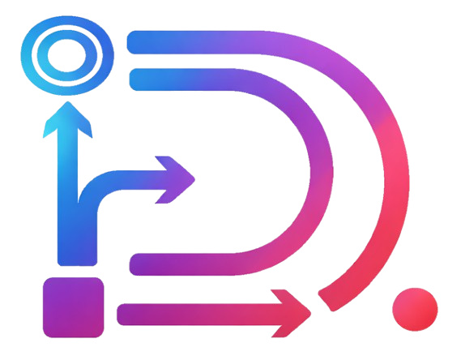

<div align="center">
  

  <h1>diagramik</h1>

  <p><strong>Turn a plain description into a polished diagram. No tech knowledge required.</strong></p>
</div>

---

## What is diagramik?

**diagramik** is an agentic AI application built for everyone — not just engineers.

You describe the diagram you want in plain English. The AI figures out the rest: what type of diagram fits your intent, how to structure it, and how to render it into a clean, exportable image. No prompting skills. No tooling knowledge. Just describe what you want and get something you can actually use.

> *"Show me the deployment flow for a web app with a load balancer, two app servers, and a database."*
> *"Draw an org chart for a small startup: CEO at the top, three department heads below, two people under each."*

That's all it takes.

---

diagramik is also a personal showcase — a living portfolio of the technologies I work with daily. Every layer of this project reflects real-world production patterns: from infrastructure-as-code to agentic prompt optimization to CI/CD automation. The stack is chosen not for novelty, but for maturity and pragmatism.

---

## User Flow

The experience is intentionally simple:

1. **Sign in** — via Google OAuth or email/password
2. **Describe your diagram** — in a chat interface, as you would to a colleague
3. **Get an image** — the AI agent selects the right diagram type and renders it
4. **Browse your history** — all generated diagrams are saved with full version history
5. **Save or share** — download the image, use it wherever you need it

<!-- TODO: replace placeholder with generated screenshot -->
> *Diagram placeholder — generate this with diagramik:*
> ```
> Draw a simple user flow: user opens browser, logs in, describes a diagram in a chat, receives the generated image, and saves it. Use a flowchart with left-to-right direction. Label each step clearly.
> ```

---

## Technical Architecture

The architecture is deliberately layered. Each concern lives in its own well-defined boundary — making the system easy to reason about, easy to extend, and easy to deploy.

### Deployed Infrastructure

The production environment runs on **Google Cloud Platform** and is fully defined in Terraform. There are no manual steps in the deployment — infrastructure is code.

**Key components:**

- **VPC Network** — a private Virtual Private Cloud (`diagramik-vpc`, `10.0.0.0/24`) isolates internal services from the public internet
- **Global Load Balancer** — a single entry point for all traffic, with path-based routing and CDN enabled for the frontend
- **Cloud Router + NAT** — internal services can reach the internet (e.g., LLM APIs) without being reachable from it
- **Django Monolith** — the REST API runs on Cloud Run; handles authentication, diagram management, quota enforcement, and agent orchestration. The only service exposed to the public internet.
- **MCP Service** — a second Cloud Run service for diagram rendering, accessible only via internal VPC. No public ingress. Authenticated service-to-service calls only.
- **Cloud SQL** — PostgreSQL database with private IP only; no public endpoint
- **GCS Bucket** — stores rendered diagram images, served via signed URLs
- **Frontend Bucket** — static assets served via the Load Balancer with CDN

<!-- TODO: replace placeholder with generated diagram -->
> *Architecture diagram placeholder — generate this with diagramik:*
> ```
> Draw a cloud architecture diagram for a web application on GCP. Include: a Global Load Balancer at the top that routes traffic to a Cloud Run service (Django API) and a GCS static frontend bucket. The Django API sits inside a VPC and connects privately to a Cloud SQL database and to an internal-only MCP Cloud Run service. The MCP service uses Cloud Router with NAT to reach external APIs. Add a GCS bucket for storing generated images connected to the MCP service. Use a top-down layout.
> ```

---

### Release Cycle

The project follows **GitHub Flow**: all development happens on feature branches, merged to `main` via pull requests. Releases are created as GitHub Releases (semantic versioning), which automatically trigger the full production deployment pipeline.

On each new release, the pipeline:

1. Builds Docker images for both the Django monolith and the MCP service
2. Pushes images to GitHub Container Registry and Google Artifact Registry
3. Applies Terraform — infrastructure updates are atomic with code changes
4. Builds the Astro frontend as a static site and publishes it to GCS

One release tag. One pipeline run. Everything is live.

<!-- TODO: replace placeholder with generated diagram -->
> *Release pipeline diagram placeholder — generate this with diagramik:*
> ```
> Draw a CI/CD pipeline diagram. Start with a developer pushing a Git tag on GitHub. This triggers a GitHub Actions workflow with the following sequential steps: Checkout code, Build Docker images (two parallel boxes: Django Monolith and MCP Service), Push images to registries (two parallel: GHCR and Google Artifact Registry), Run Terraform apply, Build Astro frontend, Publish frontend to GCS. Use a top-down flowchart.
> ```

---

### Internal Architecture: REST Layer and Agent Development

One of the most deliberate decisions in this project is the **strict separation between the REST API and the AI agent layer**.

The Django monolith handles everything a production web service needs — authentication, data models, user quotas, API routing, email. It is a stable, well-tested service that changes infrequently.

The agent logic lives in a completely separate Python package (`backend/agent/`). It can be run, tested, and iterated on locally with zero Django dependency. This separation means:

- **Fast local experimentation** — spin up the agent against a local or remote MCP server in seconds
- **Independent iteration** — prompt changes, routing logic, and diagram strategies evolve on their own cadence
- **Clean interfaces** — the REST layer calls the agent through a well-defined boundary; the agent calls diagram tools through MCP

**The agent stack:**

- **[fast-agent-mcp](https://github.com/evalstate/fast-agent)** — orchestrates multi-step agentic workflows using the Model Context Protocol
- **[DSPy](https://dspy.ai/)** — used for structured prompt optimization; the routing and diagram-type selection logic is compiled against real examples, not hand-crafted prompts
- **OpenTelemetry** — distributed tracing built in from day one; agent runs are observable in production
- **MLflow** — used during development for tracking optimization experiments

**The MCP tool server** (`backend/mcp_diagrams/`) exposes two diagram rendering tools over HTTP/2:

- `draw_technical_diagram` — uses the [Python Diagrams](https://diagrams.mingrammer.com/) library for cloud and infrastructure diagrams
- `draw_mermaid` — renders any [Mermaid](https://mermaid.js.org/) diagram definition to SVG or PNG

The agent decides which tool fits the user's request, constructs the arguments, calls the tool, and returns the GCS URI of the result.

<!-- TODO: replace placeholder with generated diagram -->
> *Internal architecture diagram placeholder — generate this with diagramik:*
> ```
> Draw a component diagram showing the internal architecture of the backend. On the left, show a User making an HTTP request to a Django REST API. The Django API talks to a PostgreSQL database and also calls an Agent module. The Agent module uses DSPy for routing decisions, then calls a FastAgent orchestrator. The FastAgent connects over HTTP/2 to an MCP Server. The MCP Server has two tools: draw_technical_diagram (using Python Diagrams library) and draw_mermaid (using Mermaid renderer). Both tools save output to a GCS Bucket. Use a left-to-right layout.
> ```

---

## Technology Summary

| Layer | Technology |
|---|---|
| Frontend | [Astro](https://astro.build/) (SSG) + [Vue.js](https://vuejs.org/) + [Tailwind CSS](https://tailwindcss.com/) |
| REST API | [Django](https://www.djangoproject.com/) + [Django REST Framework](https://www.django-rest-framework.org/) |
| Agent Orchestration | [fast-agent-mcp](https://github.com/evalstate/fast-agent) |
| Prompt Optimization | [DSPy](https://dspy.ai/) |
| Diagram Rendering | [Python Diagrams](https://diagrams.mingrammer.com/) + [Mermaid](https://mermaid.js.org/) |
| Infrastructure | [Terraform](https://www.terraform.io/) on [Google Cloud Platform](https://cloud.google.com/) |
| CI/CD | [GitHub Actions](https://github.com/features/actions) |
| Observability | [OpenTelemetry](https://opentelemetry.io/) + [MLflow](https://mlflow.org/) |

---

## Repository Structure

```
diagramik/
├── frontend/          # Astro SSG application
├── backend/
│   ├── django_monolith/   # REST API, auth, data models
│   ├── agent/             # AI agent (DSPy + FastAgent) — independently runnable
│   └── mcp_diagrams/      # MCP tool server for diagram rendering
└── infrastructure/    # Terraform — all GCP resources defined as code
```
