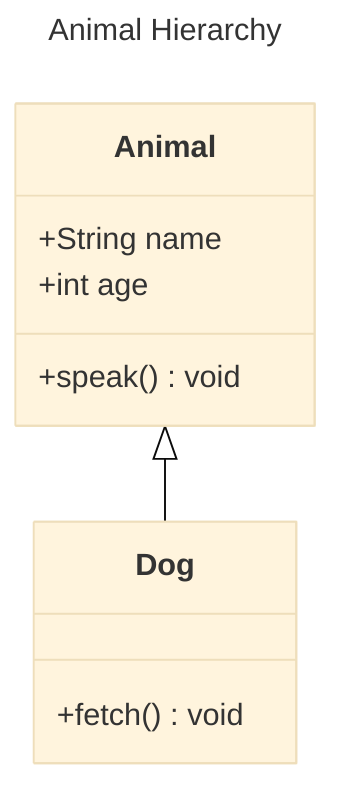
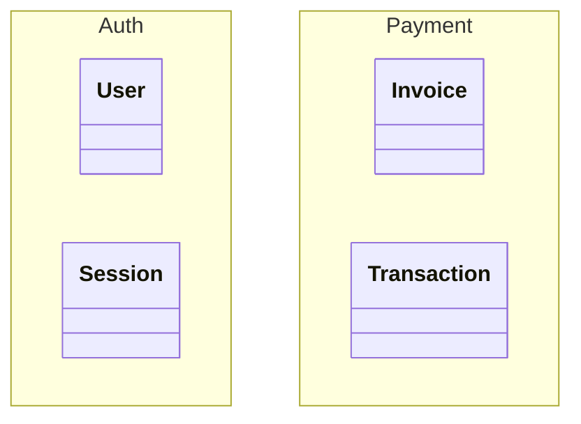
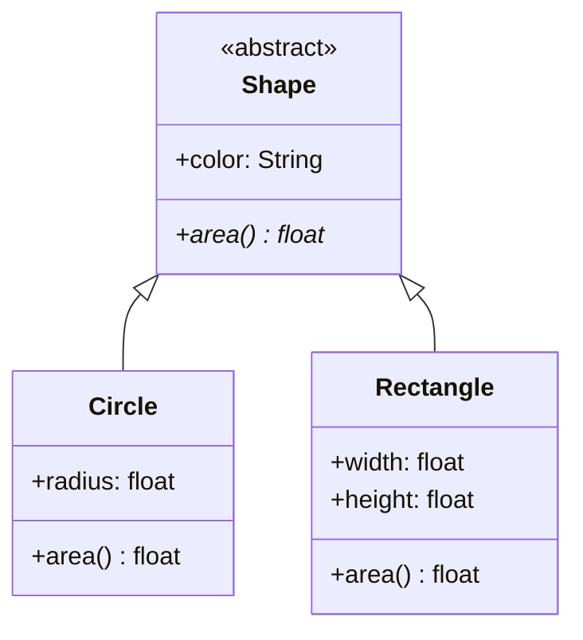
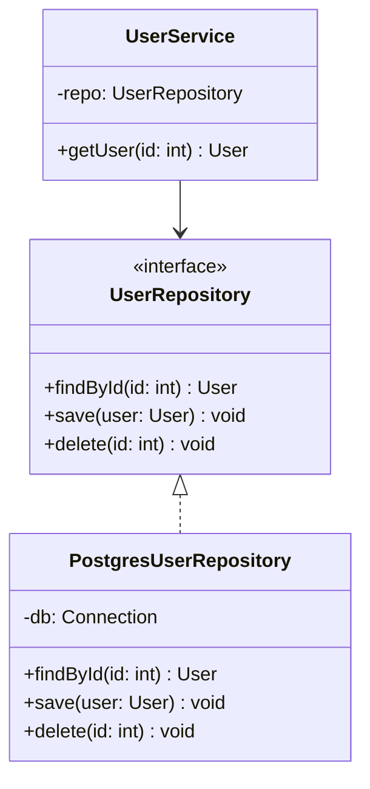

# Mermaid Class Diagram Skill

Use this skill to write Mermaid `classDiagram` diagrams — ideal for OOP design, domain modeling, and data structure documentation.

## Basic structure



Always wrap in a fenced code block with `mermaid` language tag.

## Config options

Always include a YAML frontmatter block to set the title and theme:

```
---
title: My Class Diagram
config:
  theme: base
---
```

Always set:
- `title` — descriptive name shown above the diagram
- `theme: base` — clean, customizable styling that works across renderers

Class-specific options under `class:`:

```
---
title: My Class Diagram
config:
  theme: base
  class:
    diagramPadding: 20
---
```

| Option | Default | Effect |
|--------|---------|--------|
| `diagramPadding` | `10` | Padding around the diagram |

For complex diagrams with many classes, switch to the ELK layout engine for better auto-layout:

```
---
title: My Class Diagram
config:
  theme: base
  layout: elk
---
```

## Defining a class

Two styles — pick one and be consistent:

**Braces style (preferred for multiple members):**
```
class ClassName {
    +field: Type
    -privateField: Type
    #protectedField: Type
    +method(param: Type) ReturnType
}
```

**Colon style (for quick one-liners):**
```
ClassName : +field Type
ClassName : +method() ReturnType
```

## Visibility modifiers

| Symbol | Visibility |
|--------|------------|
| `+` | Public |
| `-` | Private |
| `#` | Protected |
| `~` | Package/Internal |

## Member classifiers

Append after the return type:
- `*` — Abstract method: `+speak()* void`
- `$` — Static method/field: `+getInstance()$ ClassName`

## Generic types

Use tildes: `~List~String~`, `~Map~String, int~`

## Relationships

| Syntax | Relationship | Meaning |
|--------|--------------|---------|
| `A <\|-- B` | Inheritance | B extends A |
| `A <\|.. B` | Realization | B implements A |
| `A *-- B` | Composition | A owns B (B can't exist without A) |
| `A o-- B` | Aggregation | A has B (B can exist independently) |
| `A --> B` | Association | A uses B |
| `A -- B` | Link | Plain connection |
| `A ..> B` | Dependency | A depends on B |

Direction of the arrow matters — `A <|-- B` means "B inherits from A".

## Cardinality labels

```
ClassA "1" --> "0..*" ClassB : has
```

Common values: `1`, `0..1`, `1..*`, `*`, `n`

## Annotations (stereotypes)

Mark interfaces, abstract classes, enums:
```
class PaymentService {
    <<interface>>
    +process(amount: float) bool
}
class Status {
    <<enumeration>>
    PENDING
    ACTIVE
    CLOSED
}
```

## Namespaces (grouping)



## Notes

```
note for ClassName : "This class handles X"
```

## Tips for good class diagrams

- Show only the members relevant to the diagram's purpose — omit getters/setters unless they're special
- Use composition (`*--`) for "owns" and aggregation (`o--`) for "uses" — don't just use `-->`
- Add cardinality labels when multiplicity is non-obvious
- Group related classes with `namespace`
- Avoid trying to show everything — one diagram per concern (auth, domain, persistence)
- Interfaces and abstract classes should use `<<interface>>` / `<<Abstract>>` annotations

## Common patterns

**Inheritance hierarchy:**


**Repository pattern:**

