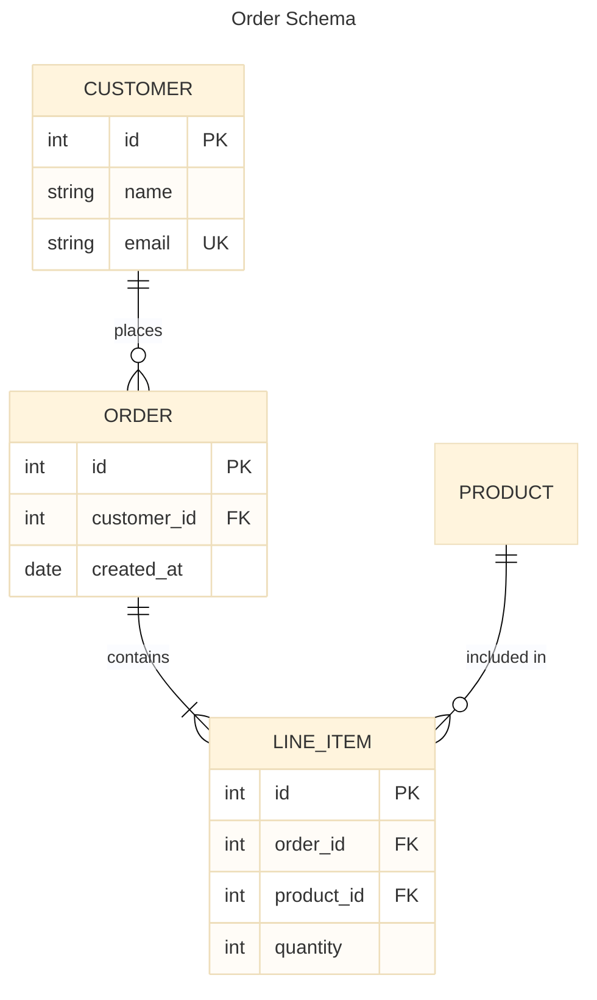
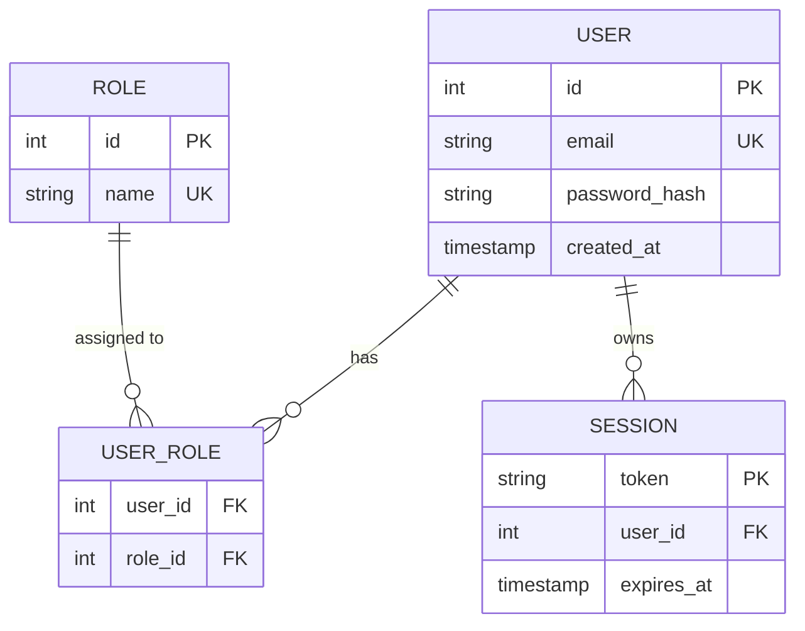
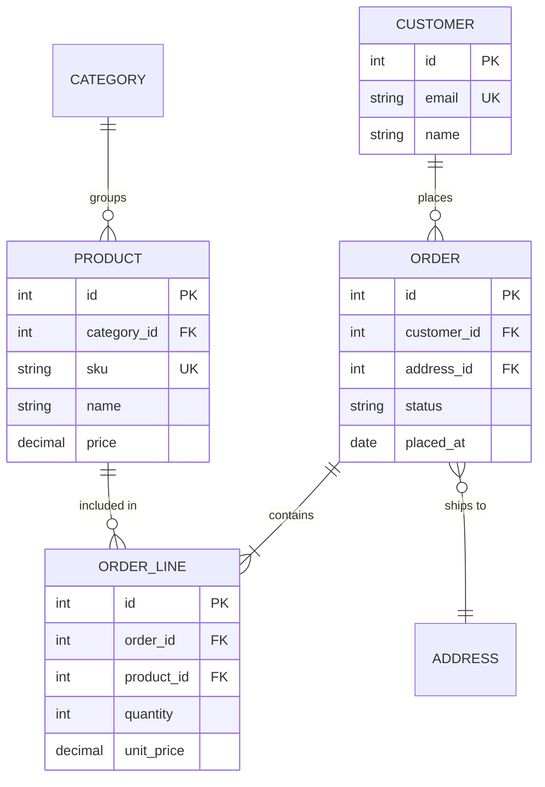

# Mermaid ER Diagram Skill

Use this skill to write Mermaid `erDiagram` diagrams — the standard way to visualize relational database schemas and domain models using crow's foot notation.

## Basic structure



Always wrap in a fenced code block with `mermaid` language tag.

## Config options

Always include a YAML frontmatter block to set the title and theme:

```
---
title: My ER Diagram
config:
  theme: base
---
```

Always set:
- `title` — descriptive name shown above the diagram
- `theme: base` — clean, customizable styling that works across renderers

ER-specific options under `er:`:

```
---
title: My ER Diagram
config:
  theme: base
  er:
    diagramPadding: 20
---
```

| Option | Default | Effect |
|--------|---------|--------|
| `diagramPadding` | `20` | Padding around the diagram |

For complex diagrams with many entities, switch to the ELK layout engine for better auto-layout:

```
---
title: My ER Diagram
config:
  theme: base
  layout: elk
---
```

## Relationship syntax

```
ENTITY_A <left-cardinality><identification><right-cardinality> ENTITY_B : "label"
```

### Cardinality symbols

| Left side | Right side | Meaning |
|-----------|-----------|---------|
| `\|o` | `o\|` | Zero or one |
| `\|\|` | `\|\|` | Exactly one |
| `}o` | `o{` | Zero or more |
| `}\|` | `\|{` | One or more |

### Identification (line style)

| Symbol | Line | Meaning |
|--------|------|---------|
| `--` | Solid | Identifying — child cannot exist without parent |
| `..` | Dashed | Non-identifying — entities can exist independently |

### Full relationship examples

| Syntax | Reads as |
|--------|---------|
| `A \|\|--o{ B : label` | A has zero-or-many B; B belongs to exactly one A |
| `A \|\|--\|\| B : label` | A has exactly one B; B belongs to exactly one A |
| `A \|o--o{ B : label` | A has zero-or-many B; B optionally belongs to one A |
| `A }o..\|{ B : label` | A has one-or-many B (non-identifying); B has one-or-many A |

**The label is required.** Use a short verb phrase: `"places"`, `"contains"`, `"belongs to"`. Wrap in quotes if it has spaces.

## Defining entities and attributes

```
ENTITY_NAME {
    type   attributeName   KeyDesignator   "optional comment"
}
```

| Part | Notes |
|------|-------|
| `type` | Any string starting with a letter: `int`, `string`, `date`, `varchar(255)`, `enum[A,B]` |
| `attributeName` | The field name |
| `PK` | Primary key |
| `FK` | Foreign key |
| `UK` | Unique key |
| `"comment"` | Optional quoted annotation |

Multiple key designators: `PK, FK` (composite key that's also a foreign key).

**Display alias** — show a friendlier name in the diagram:
```
ORDER_LINE [Order Line Item] {
    int id PK
}
```

## Direction

```
erDiagram
    direction LR
    ...
```

| Option | Use when |
|--------|---------|
| `TB` | Tall schemas, hierarchical models (default) |
| `LR` | Wide schemas, pipeline-like relationships |

## Tips for good ER diagrams

- Use `--` (solid/identifying) for FK relationships where the child has no meaning without the parent (e.g., `ORDER_LINE` without `ORDER`)
- Use `..` (dashed/non-identifying) for optional associations (e.g., `CUSTOMER` and `ADDRESS` — both can exist alone)
- Always label relationships with a verb (`places`, `contains`, `assigns`) — not just a line
- Show only the attributes that matter for the diagram's purpose — avoid listing every column for large tables
- Use `PK`, `FK`, `UK` designators — they communicate schema intent at a glance
- If entity names have spaces, quote them: `"Order Item"`
- Use `direction LR` for schemas with many one-to-many chains (it reads like a pipeline)

## Common patterns

**User/auth model:**


**E-commerce order model:**

