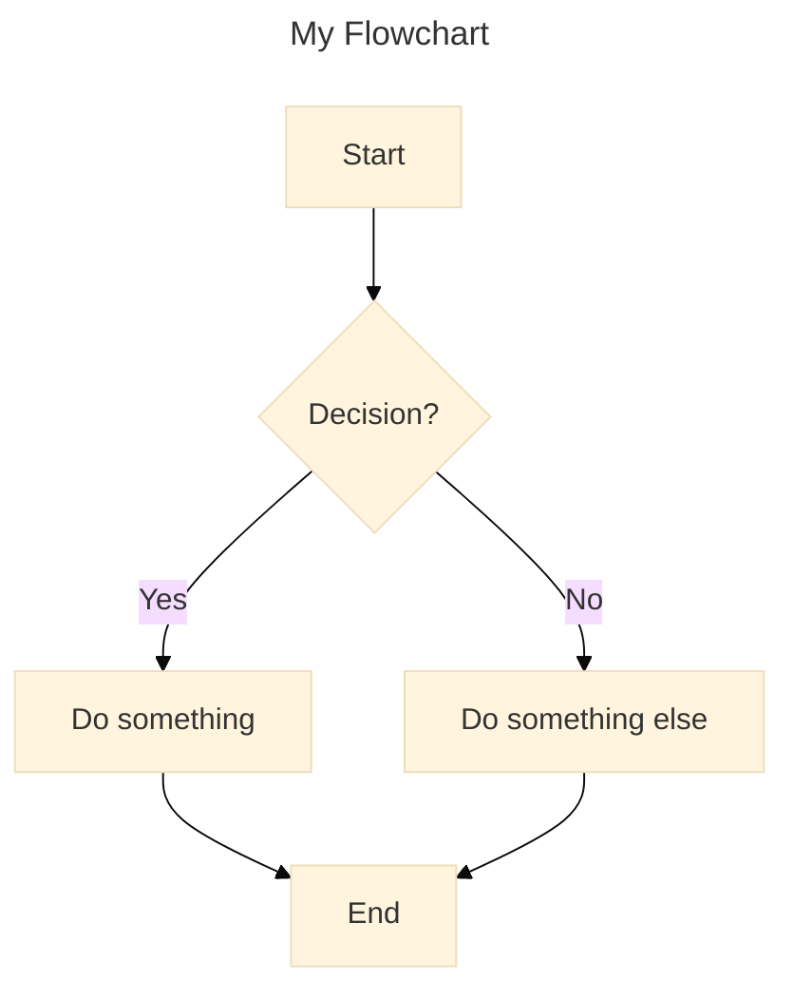
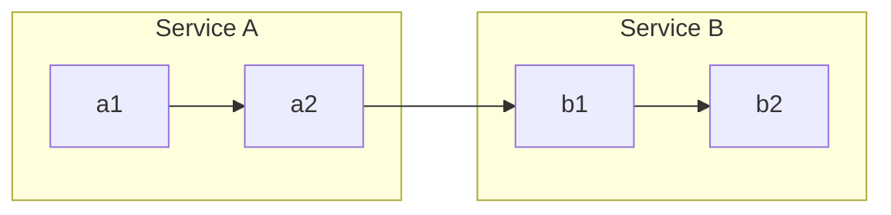
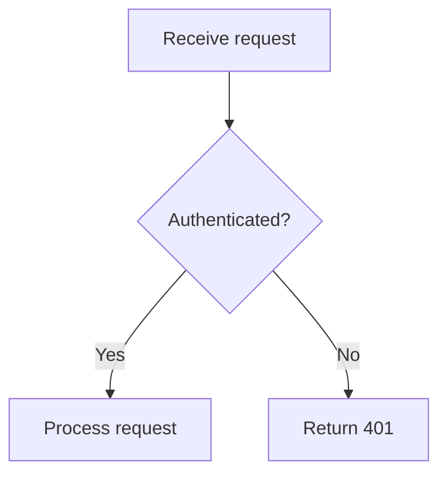
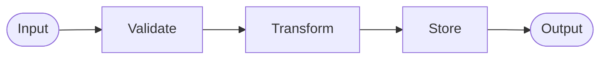
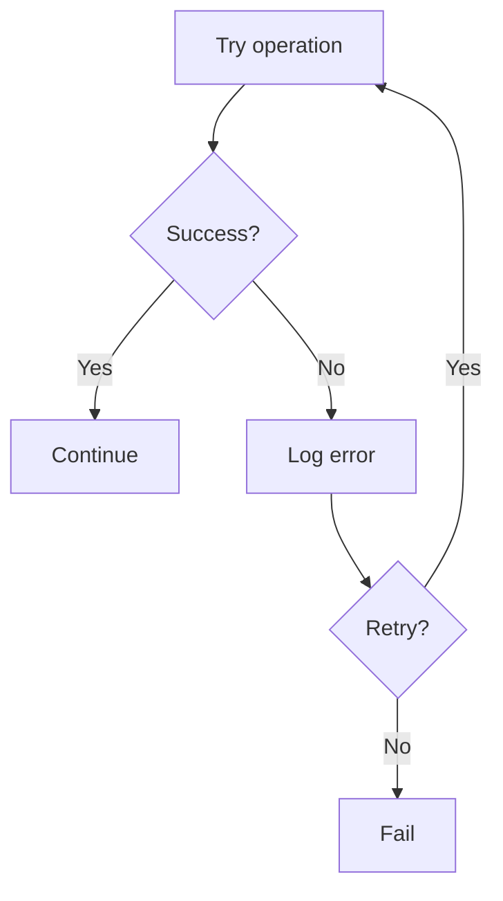

# Mermaid Flowchart Skill

Use this skill to write Mermaid `flowchart` (or `graph`) diagrams. Mermaid flowcharts are rendered as SVG and work in GitHub, GitLab, Notion, Obsidian, and any Markdown renderer with Mermaid support.

## Basic structure



Always wrap in a fenced code block with `mermaid` language tag.

## Config options

Always include a YAML frontmatter block to set the title and theme:

```
---
title: My Flowchart
config:
  theme: base
---
```

Always set:
- `title` — descriptive name shown above the diagram
- `theme: base` — clean, customizable styling that works across renderers

Flowchart-specific options under `flowchart:`:

```
---
title: My Flowchart
config:
  theme: base
  flowchart:
    diagramPadding: 8
    nodeSpacing: 50
    rankSpacing: 50
---
```

| Option | Default | Effect |
|--------|---------|--------|
| `diagramPadding` | `8` | Padding around the diagram |
| `nodeSpacing` | `50` | Horizontal spacing between nodes |
| `rankSpacing` | `50` | Vertical spacing between ranks |

## Direction

| Keyword | Meaning |
|---------|---------|
| `TD` / `TB` | Top → bottom (default) |
| `BT` | Bottom → top |
| `LR` | Left → right |
| `RL` | Right → left |

Pick direction based on content: processes flow `TD`, timelines/pipelines flow `LR`.

## Node shapes

| Syntax | Shape | When to use |
|--------|-------|-------------|
| `A[text]` | Rectangle | Process step, action |
| `A(text)` | Rounded rectangle | Start/end, soft steps |
| `A([text])` | Stadium | Terminal state |
| `A[[text]]` | Subroutine | Called function/subprocess |
| `A[(text)]` | Cylinder | Database, storage |
| `A((text))` | Circle | Event, junction |
| `A{text}` | Diamond | Decision, condition |
| `A{{text}}` | Hexagon | Preparation step |
| `A>text]` | Asymmetric | Tag, annotation |

Use consistent shapes: all decisions as diamonds, all actions as rectangles.

## Link (edge) types

| Syntax | Arrow style | Use for |
|--------|-------------|---------|
| `A --> B` | Solid arrow | Normal flow |
| `A --- B` | Solid line, no head | Association |
| `A -.-> B` | Dotted arrow | Optional/conditional |
| `A ==> B` | Thick arrow | Critical path |
| `A <--> B` | Bidirectional | Two-way relationship |
| `A ~~~B` | Invisible | Layout spacing |

Add labels: `A -->|label| B` or `A -- label --> B`

## Subgraphs (grouping)



Subgraphs can have their own `direction`:
```
subgraph sub1
    direction LR
    ...
end
```

## Styling

Apply styles to individual nodes:
```
style A fill:#f9f,stroke:#333,stroke-width:2px
```

Or define reusable classes:
```
classDef danger fill:#f00,color:#fff
class A,B danger
```

Or inline: `A:::danger`

## Tips for good flowcharts

- Give every node a short, meaningful ID (`login`, `validateInput`) — this makes the diagram code readable
- Keep node labels concise (prefer short action phrases)
- Use subgraphs to group related steps (e.g., by service, phase, or actor)
- Avoid crossing edges when possible — rearrange node order or flip direction
- Use comments (`%% comment`) to explain non-obvious sections

## Common patterns

**Decision branch:**


**Multi-step pipeline:**


**Error handling:**

