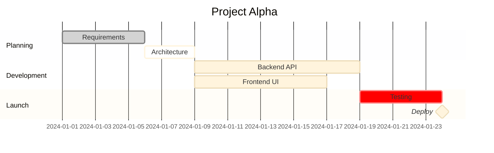
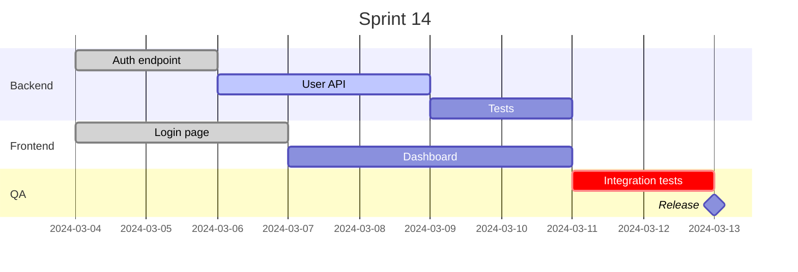
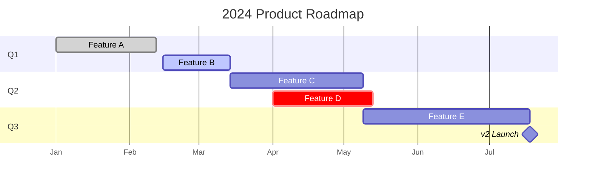

# Mermaid Gantt Chart Skill

Use this skill to write Mermaid `gantt` diagrams — great for project plans, sprint schedules, and task timelines.

## Basic structure



Always wrap in a fenced code block with `mermaid` language tag.

## Config options

Always include a YAML frontmatter block to set the title and theme:

```
---
title: My Gantt Chart
config:
  theme: base
  gantt:
    leftPadding: 100
---
```

Always set:
- `title` — descriptive name shown above the diagram
- `theme: base` — clean, customizable styling that works across renderers

Gantt-specific options under `gantt:`:

| Option | Default | Effect |
|--------|---------|--------|
| `leftPadding` | `75` | Width reserved for task labels on the left |
| `barGap` | `4` | Gap between bars in the same section |
| `barHeight` | `20` | Height of each bar |
| `gridLineStartPadding` | `35` | Padding before the first grid line |
| `fontSize` | `11` | Font size for labels |

Use `leftPadding: 100` (or more) when task labels are long.

## Required configuration

Put these at the top before any sections:

```
dateFormat  YYYY-MM-DD    ← how dates are written in the diagram source
```

Common date formats:
- `YYYY-MM-DD` — ISO date (recommended)
- `DD/MM/YYYY` — European style
- `MM/DD/YYYY` — US style

## Task syntax

Full form:
```
Task label   :status, id, startDate, endDate|duration
```

All parts after the colon are optional. Examples:

```
Do something           :                                  ← no id, starts after previous
Do something           :taskA, 2024-01-10, 5d             ← id + start + duration
Do something           :taskB, after taskA, 1w            ← dependency
Do something           :done, taskC, 2024-01-01, 2024-01-05  ← explicit end date
Release                :milestone, m1, after taskC, 0d    ← milestone point
```

## Task status tags

| Tag | Meaning | Visual |
|-----|---------|--------|
| *(none)* | Future/planned | Default color |
| `active` | In progress | Highlighted |
| `done` | Completed | Muted/grey |
| `crit` | Critical path | Red |
| `milestone` | Point-in-time event | Diamond marker |

Combine tags: `crit, active` — critical and in progress.

## Duration units

| Unit | Meaning |
|------|---------|
| `ms` | Milliseconds |
| `s` | Seconds |
| `m` | Minutes |
| `h` | Hours |
| `d` | Days |
| `w` | Weeks |
| `M` | Months |
| `y` | Years |

Decimals work: `1.5d`, `2.5w`

## Sections

Sections group tasks visually:
```
section Phase 1
    Task A : ...
    Task B : ...
section Phase 2
    Task C : ...
```

## Display options

Control how the timeline axis looks:

```
axisFormat %m/%d          ← display format (uses strftime codes)
tickInterval 1week        ← spacing of axis ticks
```

Common `axisFormat` patterns:
- `%Y-%m-%d` — 2024-01-15
- `%b %d` — Jan 15
- `%d/%m` — 15/01

Common `tickInterval` values: `1day`, `1week`, `1month`

## Excluding dates

```
excludes weekends
excludes 2024-12-25, 2024-01-01
```

Combine: `excludes weekends, 2024-12-25`

## Tips for good Gantt charts

- Give every task an `id` when you need to reference it as a dependency (`after taskId`)
- Mark the critical path with `crit` — it draws attention to what blocks the schedule
- Use `milestone` for deadlines, releases, or review gates
- Keep section names short (phase names, sprint names, feature names)
- Put `todayMarker off` in the config if the current date line is distracting

## Common patterns

**Software sprint:**


**Quarterly roadmap:**

