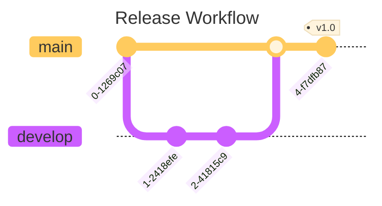
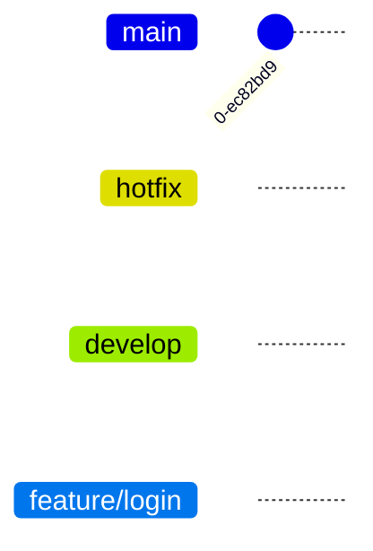
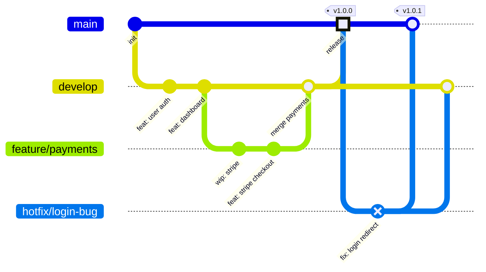
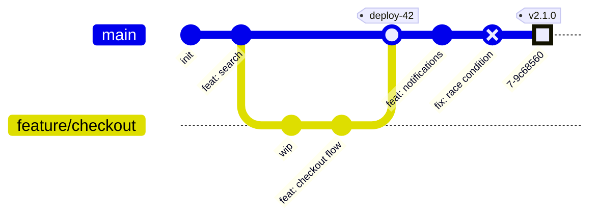

# Mermaid Git Graph Skill

Use this skill to write Mermaid `gitGraph` diagrams — perfect for documenting branching strategies, explaining git workflows, and visualizing release processes.

## Basic structure



Always wrap in a fenced code block with `mermaid` language tag.

## Config options

Always include a YAML frontmatter block to set the title and theme:

```
---
title: My Git Graph
config:
  theme: base
---
```

Always set:
- `title` — descriptive name shown above the diagram
- `theme: base` — clean, customizable styling that works across renderers

Git graph-specific options under `gitGraph:`:

```
---
title: My Git Graph
config:
  theme: base
  gitGraph:
    mainBranchName: main
    rotateCommitLabel: false
    showCommitLabel: true
    parallelCommits: false
---
```

| Option | Default | Effect |
|--------|---------|--------|
| `mainBranchName` | `"main"` | Name of the default branch |
| `rotateCommitLabel` | `true` | Rotate long commit labels 45° |
| `showCommitLabel` | `true` | Show commit ID labels |
| `showBranches` | `true` | Show branch lane lines |
| `parallelCommits` | `false` | Align commits at same depth side-by-side |

Note: the `%%{init}%%` block (shown in the section below) is an alternative config syntax — the YAML frontmatter above is preferred as it's cleaner and composable with `title`.

## Core commands

| Command | What it does |
|---------|-------------|
| `commit` | Add a commit to the current branch |
| `branch name` | Create a new branch from current position |
| `checkout name` | Switch to an existing branch |
| `merge name` | Merge named branch into current branch |
| `cherry-pick id: "abc"` | Apply a specific commit to current branch |

The default starting branch is `main`. You're always "on" a branch — commits go to whichever branch you last checked out.

## Commit options

```
commit
commit id: "descriptive-name"
commit id: "hotfix-1" type: REVERSE tag: "v1.0.1"
commit type: HIGHLIGHT
```

| Option | Purpose |
|--------|---------|
| `id: "name"` | Name the commit (shown as label) |
| `type: NORMAL` | Default solid circle |
| `type: REVERSE` | Crossed circle — use for reverts/rollbacks |
| `type: HIGHLIGHT` | Filled rectangle — use to emphasize important commits |
| `tag: "v1.0"` | Add a version tag label |

## Merge options

```
merge develop
merge develop id: "merge-release" tag: "v2.0" type: REVERSE
```

Same `id`, `type`, `tag` options as `commit`.

## Orientation

```
gitGraph LR    ← left to right (default)
gitGraph TB    ← top to bottom
gitGraph BT    ← bottom to top
```

`LR` works well for most flows. Use `TB` when you have many branches.

## Branch ordering

Control vertical position of branches:



Lower `order` = closer to the top (closer to main). Set `mainBranchOrder: 0` in config to pin main at top.

## Configuration via init block


Useful options:
- `mainBranchName` — rename `main` to `master` or whatever your default is
- `showCommitLabel` — toggle commit ID labels (default `true`)
- `showBranches` — toggle branch lane lines (default `true`)
- `parallelCommits` — when `true`, commits on different branches at the same depth are shown side-by-side rather than offset
- `rotateCommitLabel` — rotate long commit labels 45° (default `true`)

## Tips for good git graphs

- Use `id:` to give commits meaningful names — it documents what happened, not just that something happened
- Use `tag:` for version numbers, release names, and milestone markers
- Use `type: HIGHLIGHT` on the key commits (merge to main, release cut) to draw the eye
- Use `type: REVERSE` for reverts and hotfixes so they stand out
- Keep feature branches short — a diagram with 15 parallel branches is unreadable
- Use `cherry-pick` sparingly and only when the diagram is specifically about cherry-picking

## Common patterns

**Gitflow:**


**Trunk-based development:**

