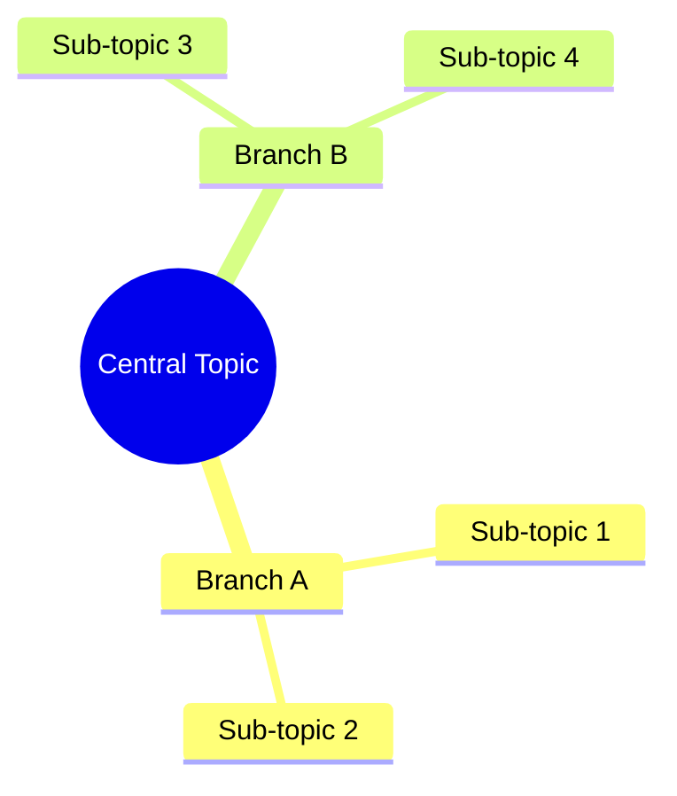
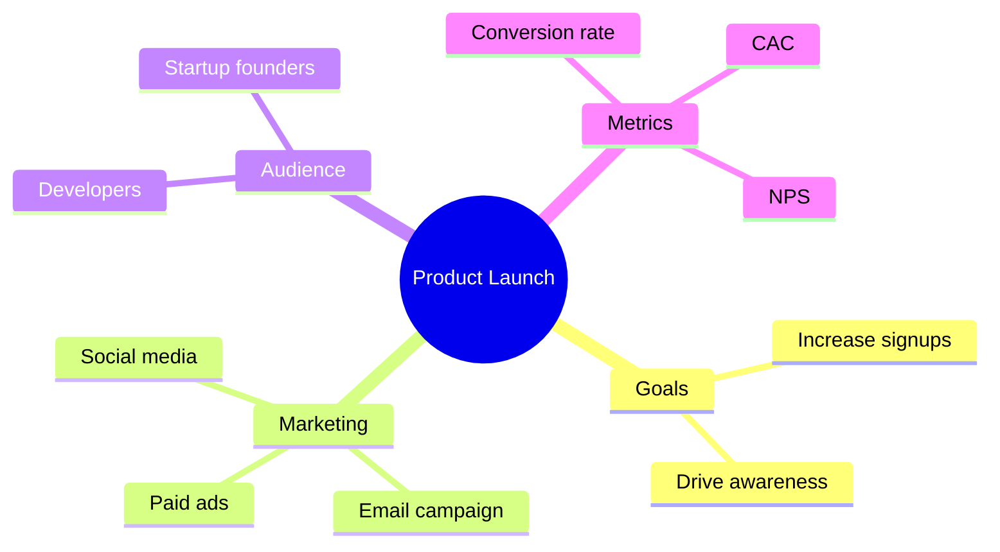
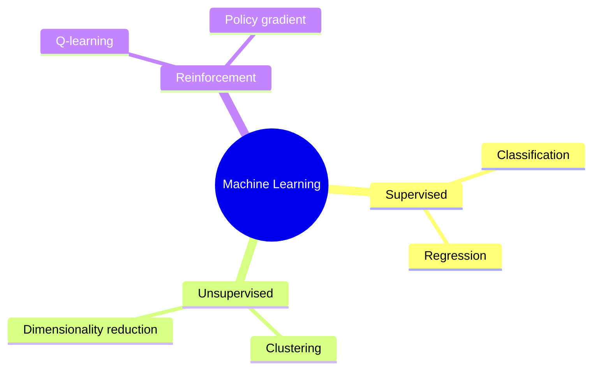
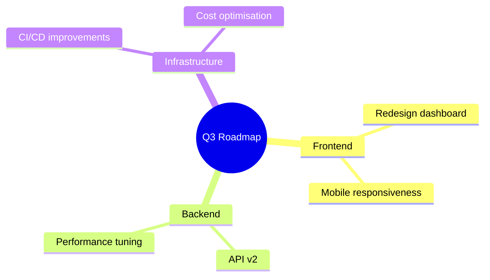

# Mermaid Mindmap Skill

Use this skill to write Mermaid `mindmap` diagrams. Mermaid mindmaps render as hierarchical tree visualizations starting from a root node.

## Basic structure



Indentation defines the hierarchy — each level of indentation is a child of the item above it.

## Config options

Include a YAML frontmatter block to set the title:

```
---
title: My Mindmap
---
```

## Node shapes

| Syntax | Shape |
|--------|-------|
| `id((text))` | Circle |
| `id[text]` | Rectangle |
| `id(text)` | Rounded rectangle |
| `id{{text}}` | Hexagon |
| `id)text(` | Bang/cloud |
| `id>text]` | Asymmetric |
| `text` (no brackets) | Default (rounded) |

Use `((text))` for the root node — it visually anchors the diagram. Use plain text or `[text]` for most branches and leaves.

## Icons and classes

Add icons using Font Awesome (when supported by the renderer):

```
mindmap
  root((Project))
    ::icon(fa fa-book)
    Planning
    ::icon(fa fa-cogs)
    Execution
```

Apply CSS classes for styling:

```
mindmap
  root((Topic))
    A[Branch]:::urgent
    B[Branch]:::normal
```

## Tips for good mindmaps

- Keep the root node short (1–3 words) — it is the visual anchor
- Limit depth to 3–4 levels; deeper trees become hard to read
- Use parallel phrasing within each branch for consistency
- Group related concepts under the same parent
- Prefer nouns for nodes; save verbs for the root or section headings

## Common patterns

**Brainstorming session:**


**Concept hierarchy:**


**Project breakdown:**

