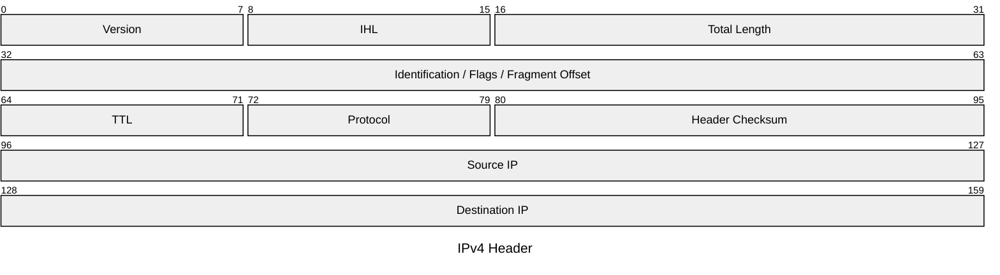
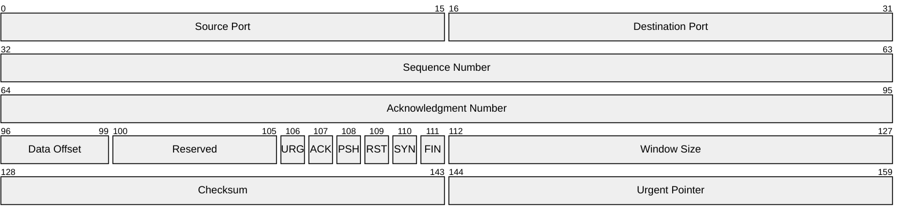
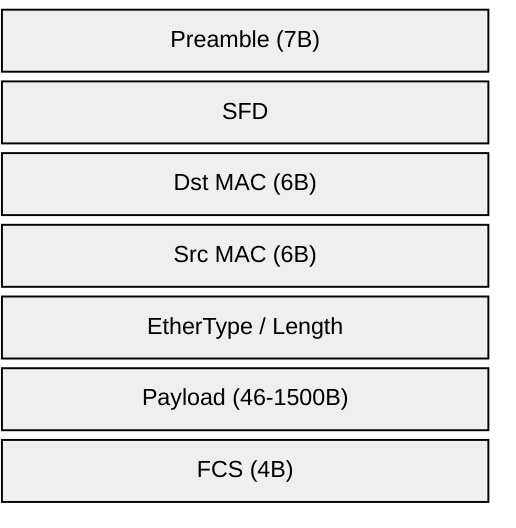
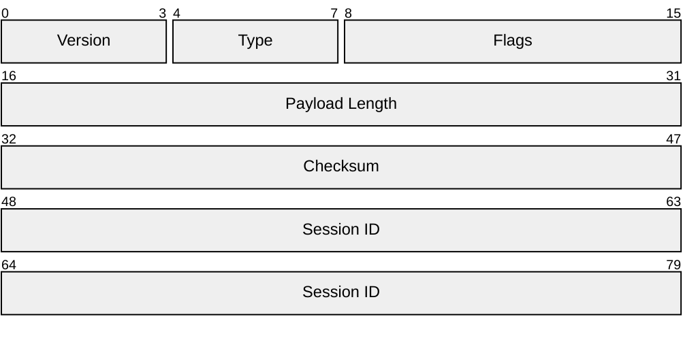

# Mermaid Packet Diagram Skill

Use this skill to write Mermaid `packet` diagrams — a specialized diagram type (added in Mermaid v11.7.0) for visualizing binary packet and protocol header structures.

## Basic structure



Always wrap in a fenced code block with `mermaid` language tag.

## Config options

Always include a YAML frontmatter block to set the title and theme:

```
---
title: My Packet Diagram
config:
  theme: base
  packet:
    bitsPerRow: 32
    showBits: true
---
```

Always set:
- `title` — descriptive name shown above the diagram
- `theme: base` — clean, customizable styling that works across renderers

Packet-specific options under `packet:`:

| Option | Default | Effect |
|--------|---------|--------|
| `bitsPerRow` | `32` | Bits per row before wrapping |
| `showBits` | `true` | Show bit position numbers above fields |
| `bitWidth` | `32` | Pixel width of each bit cell |
| `paddingX` | `3` | Horizontal padding in cells |
| `paddingY` | `6` | Vertical padding in cells |
| `rowHeight` | `32` | Height of each row in pixels |

Note: the `%%{init}%%` block (shown in the examples below) is an alternative config syntax — the YAML frontmatter above is preferred as it's cleaner and composable with `title`.

## Two ways to define fields

### Explicit bit ranges

Specify exact bit positions:
```
startBit-endBit: "Field Name"
singleBit: "Flag Bit"
```

The range is **inclusive**: `0-7` covers 8 bits (0 through 7).

### Relative notation (`+N`) — v11.7.0+

Use `+N` to automatically continue from the end of the previous field:

```
packet
    +1: "Urgent"
    +1: "ACK"
    +1: "PSH"
    +1: "RST"
    +1: "SYN"
    +1: "FIN"
    +10: "Window Size"
    +16: "Checksum"
    +16: "Urgent Pointer"
```

Each `+N` means "N bits starting from where the last field ended." You can mix both styles in one diagram.

## Tips for good packet diagrams

- Use `bitsPerRow: 32` for TCP/IP headers (it matches the standard RFC diagram format)
- Use `bitsPerRow: 8` for simple byte-level structures (file headers, simple frames)
- Turn `showBits: true` when documenting protocols (lets readers count bit positions)
- Use relative notation (`+N`) when you know field sizes but don't want to do the arithmetic manually
- Use explicit ranges when the absolute bit positions matter (referencing a spec)
- Keep field names short — they need to fit in the cell

## Common patterns

**TCP header:**


**Ethernet frame (byte-level):**


**Custom binary protocol (relative notation):**

