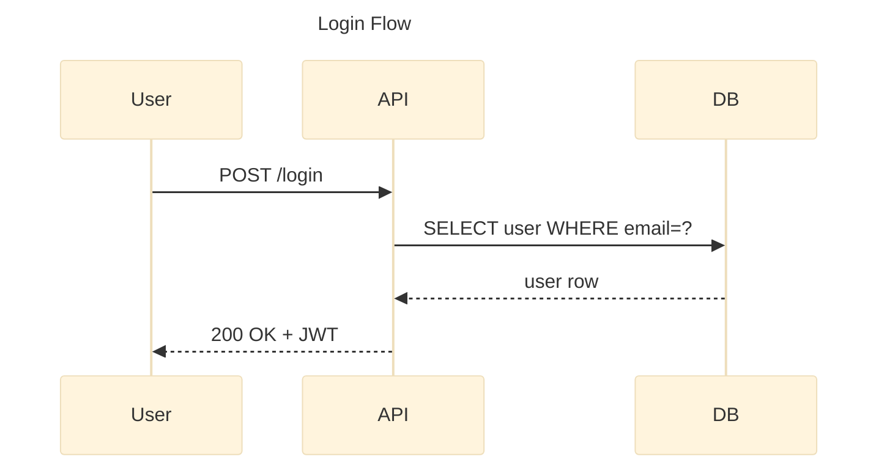
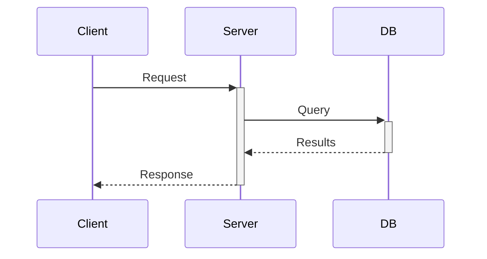
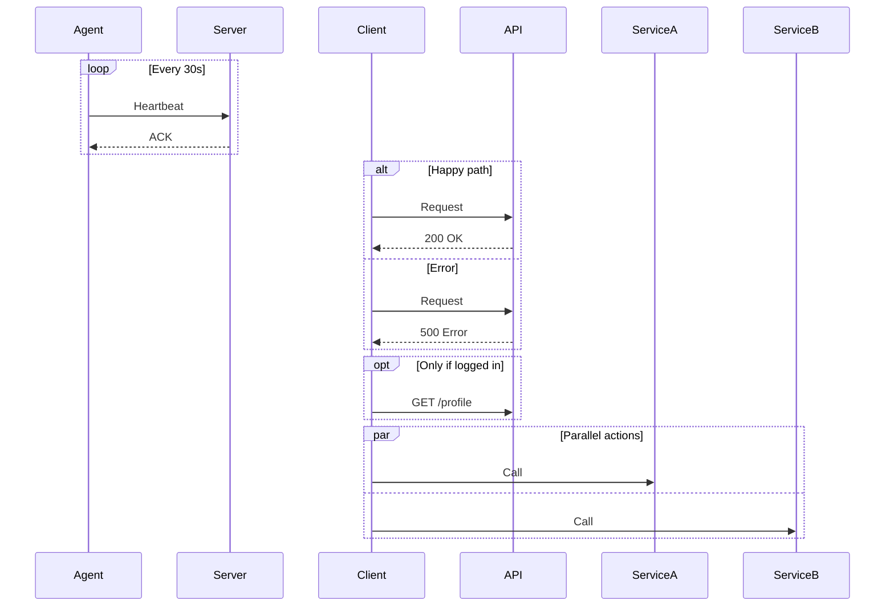
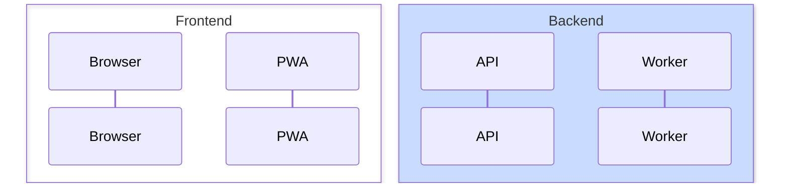
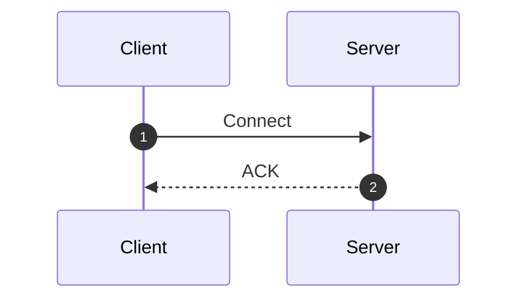
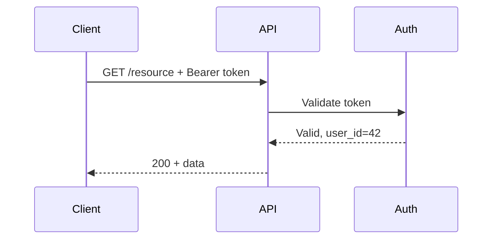
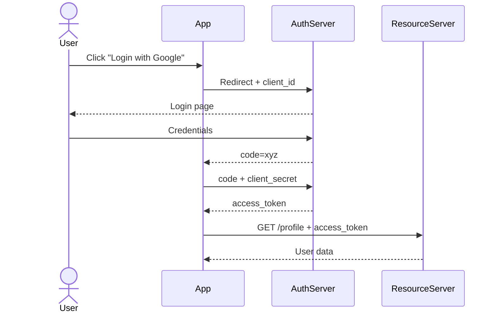

# Mermaid Sequence Diagram Skill

Use this skill to write Mermaid `sequenceDiagram` diagrams — the best way to show ordered interactions between actors or systems.

## Basic structure



Always wrap in a fenced code block with `mermaid` language tag.

## Config options

Always include a YAML frontmatter block to set the title and theme:

```
---
title: My Sequence Diagram
config:
  theme: base
---
```

Always set:
- `title` — descriptive name shown above the diagram
- `theme: base` — clean, customizable styling that works across renderers

Sequence-specific options under `sequence:`:

```
---
title: My Sequence Diagram
config:
  theme: base
  sequence:
    actorMargin: 50
    useMaxWidth: false
---
```

| Option | Default | Effect |
|--------|---------|--------|
| `actorMargin` | `50` | Horizontal space between participant boxes |
| `boxMargin` | `10` | Margin inside actor boxes |
| `useMaxWidth` | `true` | Constrain diagram to container width |
| `diagramMarginX` | `50` | Left/right outer margin |
| `diagramMarginY` | `10` | Top/bottom outer margin |

## Participant types

Declare participants explicitly at the top to control ordering and shape:

| Keyword | Shape | Use for |
|---------|-------|---------|
| `participant Name` | Rectangle | Generic component |
| `actor Name` | Stick figure | Human user |
| `participant Name as Alias` | Rectangle | Long name, short alias |

Undeclared participants appear in the order they're first used.

## Arrow types

| Syntax | Appearance | Use for |
|--------|------------|---------|
| `A->>B: msg` | Solid + arrowhead | Synchronous call/request |
| `A-->>B: msg` | Dotted + arrowhead | Response/return |
| `A->B: msg` | Solid, no head | Fire and forget |
| `A-->B: msg` | Dotted, no head | Async notification |
| `A-xB: msg` | Solid + cross | Message lost/rejected |
| `A-)B: msg` | Solid + open head | Async (non-blocking) |

Use `-->>` for responses — the dotted line visually signals "this is the reply".

## Activation (lifelines)

Show when an actor is actively processing:



`+` activates, `-` deactivates. Or use explicit `activate`/`deactivate` keywords.

## Grouping blocks



## Notes

```
Note right of Actor: text here
Note left of Actor: text here
Note over Actor1,Actor2: spans both
```

## Grouping actors with boxes



## Sequence numbers

Add `autonumber` at the top to automatically number each message — useful for documentation references:



## Tips for good sequence diagrams

- List participants top-to-bottom in the order they first appear in the flow
- Keep message labels short — use technical names (`POST /auth`, `SELECT`, `ACK`)
- Use `alt/else` for error paths rather than drawing two full flows
- Use `loop` for polling or retry logic
- Activate/deactivate when showing database transactions or processing windows helps readability
- Use `box` to group microservices or layers (frontend/backend/storage)

## Common patterns

**REST API call with auth:**


**OAuth2 flow:**

