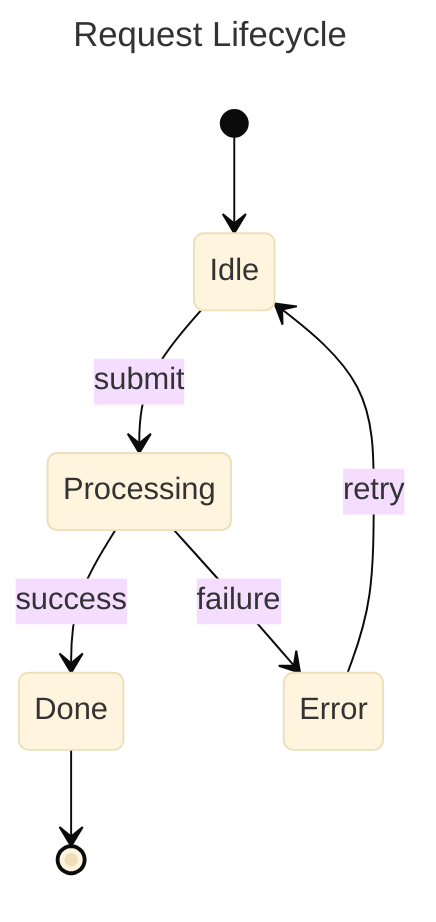
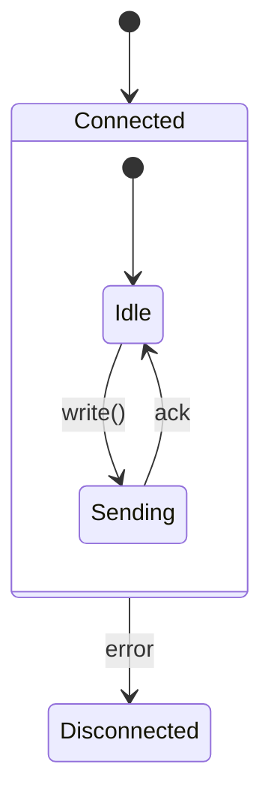
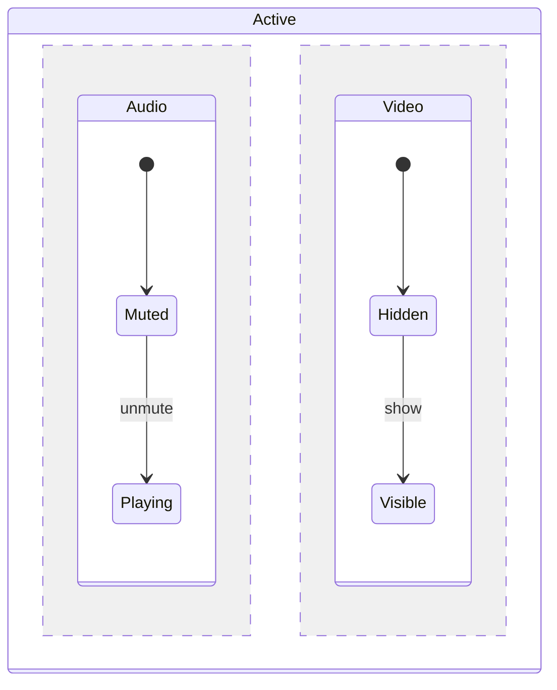
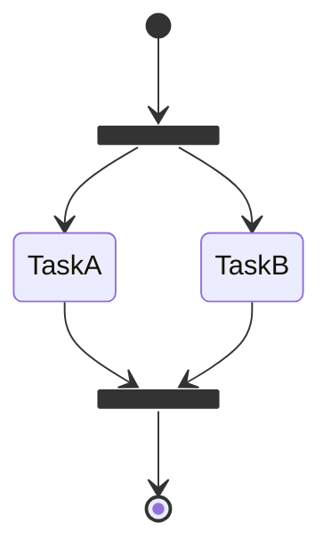
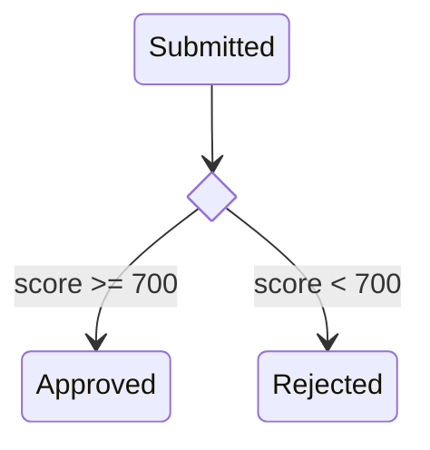
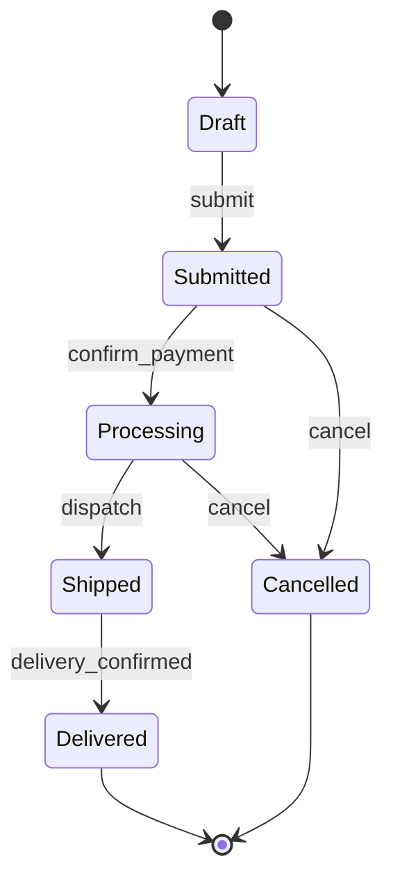
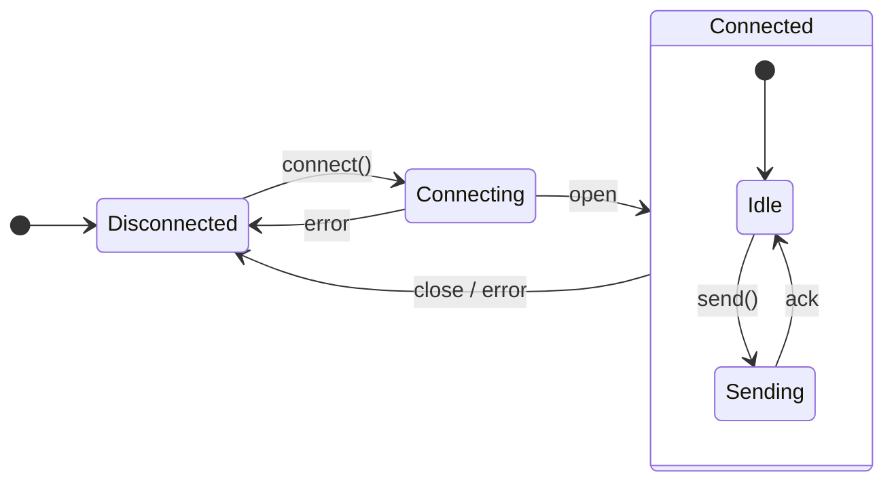

# Mermaid State Diagram Skill

Use this skill to write Mermaid `stateDiagram-v2` diagrams — the best tool for modeling finite state machines and lifecycle flows.

Always use `stateDiagram-v2` (not the legacy `stateDiagram`).

## Basic structure



Always wrap in a fenced code block with `mermaid` language tag.

## Config options

Always include a YAML frontmatter block to set the title and theme:

```
---
title: My State Diagram
config:
  theme: base
---
```

Always set:
- `title` — descriptive name shown above the diagram
- `theme: base` — clean, customizable styling that works across renderers

State-specific options under `state:`:

```
---
title: My State Diagram
config:
  theme: base
  state:
    diagramPadding: 20
---
```

| Option | Default | Effect |
|--------|---------|--------|
| `diagramPadding` | `8` | Padding around the diagram |

## Special states

| Syntax | Meaning |
|--------|---------|
| `[*]` | Start (when on left) or End (when on right) |

Every diagram must have at least one `[*] --> firstState` transition. End states use `lastState --> [*]`.

## States

```
stateName                          # simple state
stateId: Human-readable label      # state with display label
state "Long description" as id     # alias syntax
```

Use short IDs (`idle`, `processing`) and descriptive labels when needed.

## Transitions

```
A --> B                    # unlabeled transition
A --> B : event / action   # labeled (event that triggers it)
```

Label transitions with the event or condition that causes them (e.g., `submit`, `timeout`, `success`).

## Composite (nested) states

Group sub-states inside a parent state:



## Concurrent (parallel) states

Use `--` to show regions that are active simultaneously:



## Fork and join



## Choice (conditional branching)



## Notes

```
note right of stateName
    Text goes here
end note

note left of stateName : Short inline note
```

## Direction

Default is top-to-bottom. Override with:
```
stateDiagram-v2
    direction LR
    ...
```

## Tips for good state diagrams

- Every state should be reachable from `[*]` — remove orphan states
- Label transitions with the trigger event, not just "yes/no"
- Avoid putting too much logic in labels — keep them short (`timeout`, `success`, `user_cancel`)
- Use composite states when a group of states share a common parent transition (e.g., any state → `Disconnected` on network error)
- Use concurrent regions only when two truly independent sub-machines run simultaneously

## Common patterns

**Order lifecycle:**


**WebSocket connection:**

