# Mermaid Diagram Style Guide

## Overview

Generate valid Mermaid diagram syntax. Choose the most appropriate diagram type based on user intent.

## Supported Diagram Types

### 1. Flowchart (Most Common)

**Use for:** Process flows, decision trees, workflows, system flows

**Direction options:** `TD` (top-down), `LR` (left-right), `BT` (bottom-top), `RL` (right-left)

#### Node Shapes

- `[text]` - Rectangle
- `(text)` - Rounded rectangle
- `{text}` - Diamond (decision)
- `([text])` - Stadium/pill shape
- `[[text]]` - Subroutine
- `[(text)]` - Cylinder (database)
- `((text))` - Circle
- `>text]` - Flag/asymmetric

#### Edge Styles

- `-->` - Arrow
- `---` - Line
- `-.->` - Dotted arrow
- `==>` - Thick arrow
- `--text-->` - Arrow with label
- `-->|text|` - Arrow with label (alternative)

#### Example

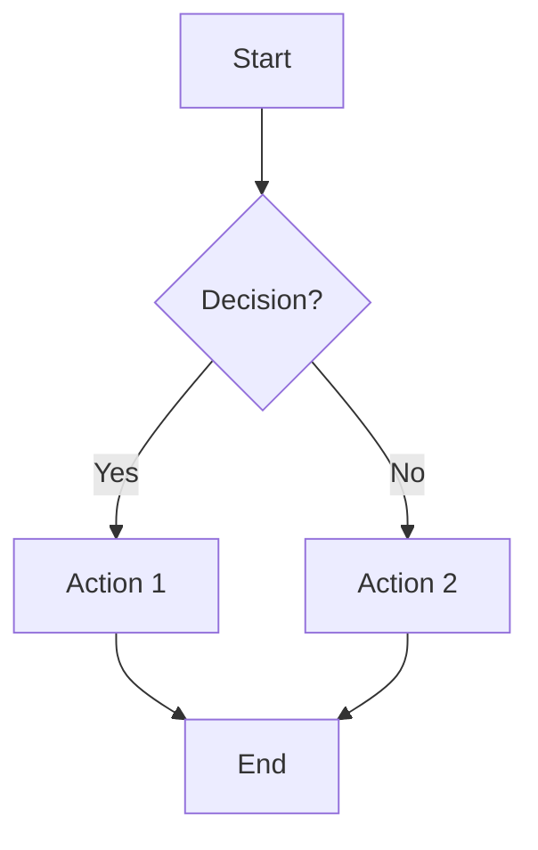

### 2. Sequence Diagram

**Use for:** API calls, message passing, interactions between services/actors

#### Arrow Types

- `->>` - Solid line with arrowhead
- `-->>` - Dotted line with arrowhead
- `-x` - Solid line with cross
- `--x` - Dotted line with cross

#### Example

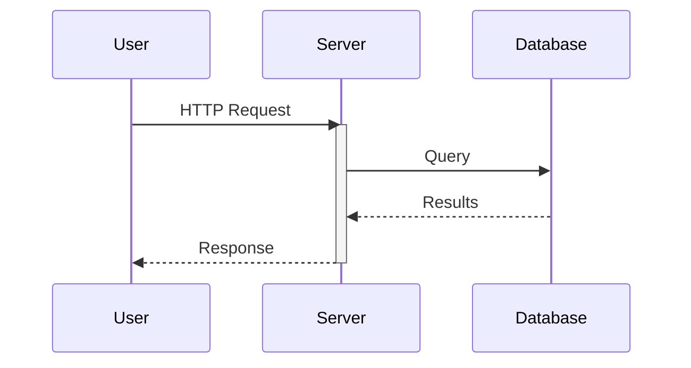

### 3. Class Diagram

**Use for:** Object-oriented design, data models, entity relationships

#### Example

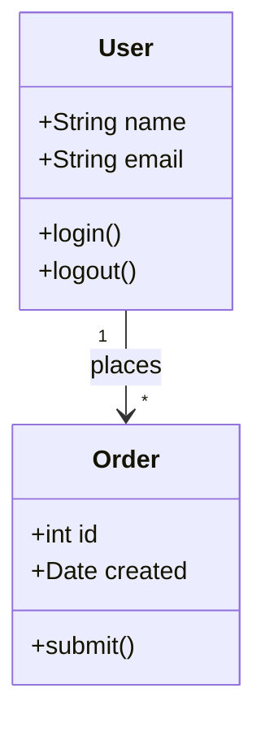

### 4. State Diagram

**Use for:** State machines, lifecycle diagrams, status transitions

#### Example

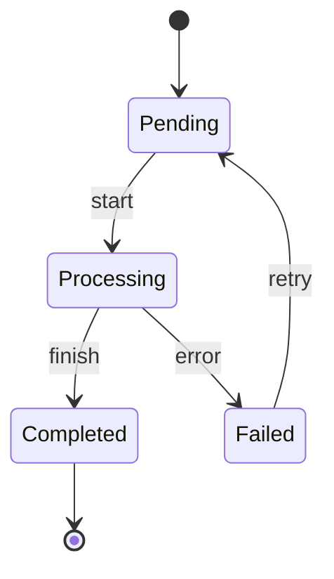

### 5. Entity Relationship Diagram

**Use for:** Database schemas, data modeling

#### Relationship Types

- `||--||` - One to one
- `||--o{` - One to many
- `o{--o{` - Many to many

#### Example

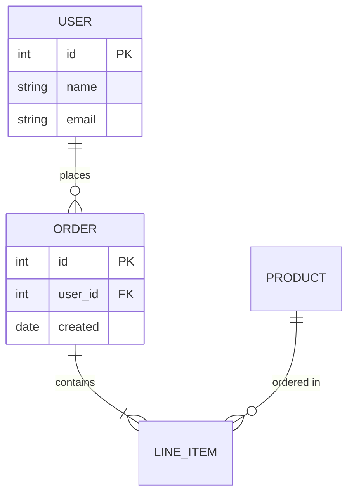

### 6. Gantt Chart

**Use for:** Project timelines, scheduling

#### Example

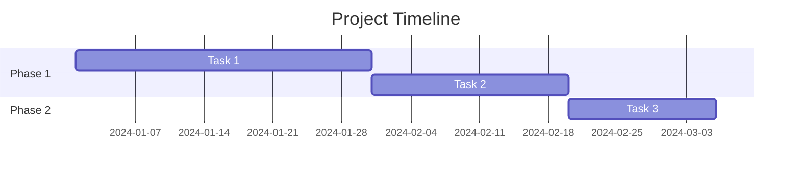

### 7. Pie Chart

**Use for:** Distribution, percentages, proportions

#### Example

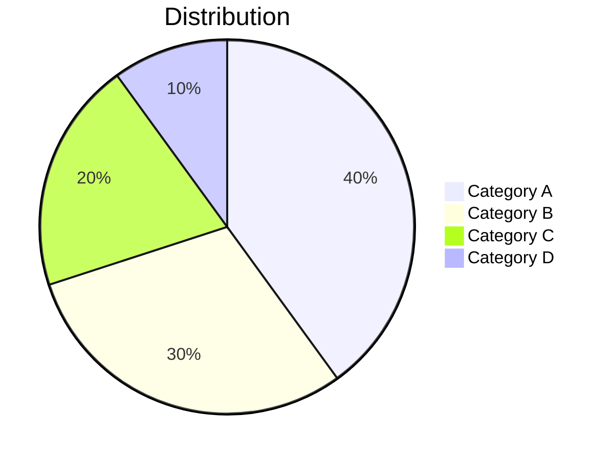

### 8. Git Graph

**Use for:** Git branching strategies, version control flows

#### Example

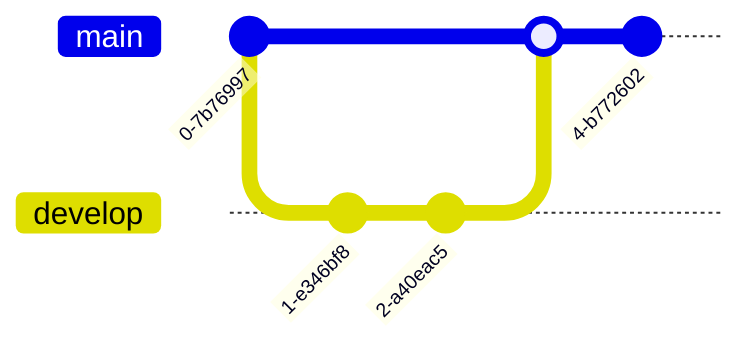

## Style Guide

### Labels

- Keep labels concise (1-3 words when possible)
- Use descriptive action verbs for edges (e.g., "sends", "queries", "returns")
- For nodes, describe what it IS, not what it does

### Subgraphs (Grouping)

Use subgraphs to group related components:

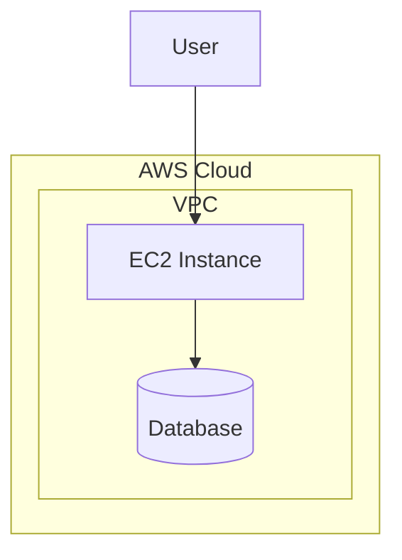

### Styling

You can add custom styles when needed:

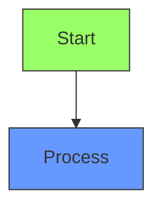

## Complete Examples

### Simple API Flow

**INPUT:** User sends request to API Gateway, which forwards to Lambda, which queries DynamoDB

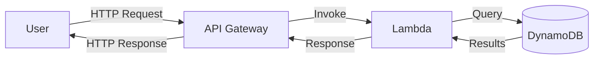

### Microservices Architecture

**INPUT:** Show a microservices architecture with an API gateway routing to user service, order service, and payment service. Each service has its own database.

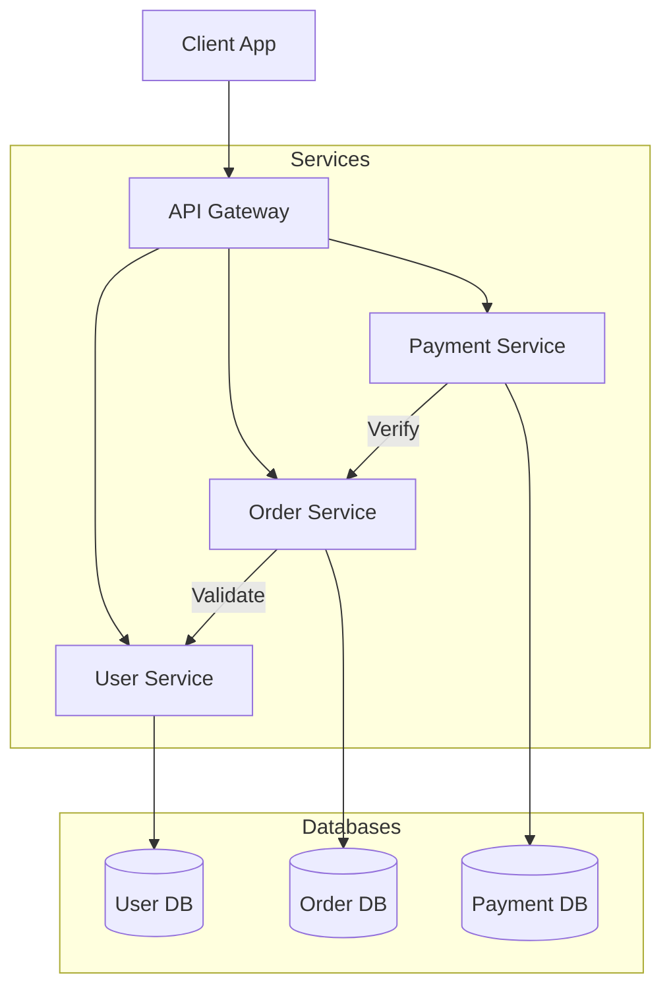

### CI/CD Pipeline

**INPUT:** Show a CI/CD pipeline from code commit through testing to deployment

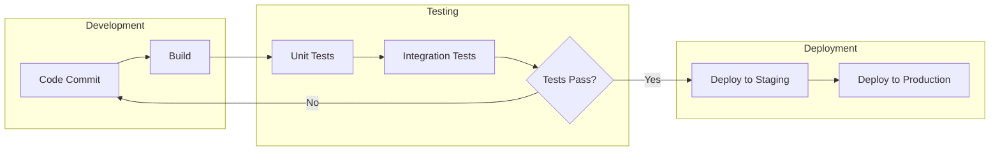
