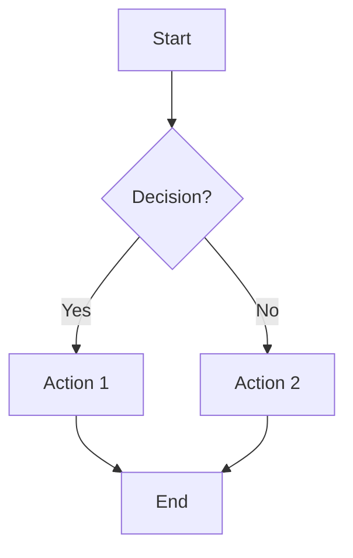

# MCP Diagrams Service Testing Guide

This directory contains comprehensive tests for the MCP (Model Context Protocol) diagrams service.

## Test Structure

```
tests/
├── conftest.py                    # Shared fixtures
├── test_unit/                     # Unit tests
│   ├── test_draw_mermaid.py      # Mermaid encoding and URL generation
│   ├── test_draw_diagram.py      # Technical diagram generation
│   └── test_move_file_to_gcs.py  # GCS upload functionality
└── test_integration/              # Integration tests
    └── test_mcp_tools.py         # MCP tool integration tests
```

## What's Being Tested

### Unit Tests

#### Mermaid Diagram Tests (`test_draw_mermaid.py`)

- **Encoding**: Base64 encoding of Mermaid code
- **Decoding**: Verify encoded data can be decoded
- **URL Generation**: mermaid.ink URL creation
- **Output Formats**: SVG, PNG, and IMG formats
- **Edge Cases**: Empty strings, special characters, consistency

#### Technical Diagram Tests (`test_draw_diagram.py`)

- **Diagram Creation**: Using Python `diagrams` library
- **Custom Attributes**: Graph, node, and edge customization
- **Code Execution**: Dynamic code execution with exec()
- **Direction Options**: LR, TB, etc.
- **File Creation**: Output file generation

#### GCS Upload Tests (`test_move_file_to_gcs.py`)

- **Upload Flow**: Client → Bucket → Blob → Upload
- **File Removal**: Local file cleanup after upload
- **Project ID**: Environment variable vs. explicit parameter
- **Error Handling**: Upload failures
- **Blob Properties**: Return value verification

### Integration Tests

#### MCP Tools Tests (`test_mcp_tools.py`)

- **draw_technical_diagram**: Full tool flow including upload
- **draw_mermaid**: Mermaid diagram tool flow
- **Validation**: Pydantic model validation
- **Environment Config**: BUCKET_NAME and GCP_PROJECT_ID
- **End-to-End Workflows**: Complete diagram creation flows

## Running Tests

### All Tests

```bash
# From mcp_diagrams directory
pytest

# From backend root
pytest mcp_diagrams/tests/
```

### Specific Categories

```bash
# Unit tests only
pytest -m unit

# Integration tests only
pytest -m integration

# Specific test file
pytest tests/test_unit/test_draw_mermaid.py

# Specific test
pytest tests/test_unit/test_draw_mermaid.py::TestEncodeMermaid::test_encode_mermaid_produces_base64_string
```

### With Coverage

```bash
# Generate coverage report
pytest --cov=. --cov-report=html

# View coverage in browser
open htmlcov/index.html
```

### Fast Tests Only

```bash
# Skip slow tests
pytest -m "not slow"
```

## Test Fixtures

### Available Fixtures (from `conftest.py`)

- **`mock_gcs_client`**: Mocked Google Cloud Storage client
- **`mock_file_system`**: Temporary file system for testing
- **`mock_diagram_library`**: Mocked `diagrams` library
- **`sample_mermaid_code`**: Example Mermaid diagram code
- **`sample_diagram_code`**: Example Python diagrams code
- **`mock_env_vars`**: Test environment variables
- **`mcp_server`**: MCP server instance
- **`mock_mcp_context`**: Async MCP context mock

### Using Fixtures

```python
def test_example(sample_mermaid_code, mock_gcs_client):
    # Fixtures are automatically injected
    result = draw_mermaid_diagram(sample_mermaid_code)
    assert "url" in result
```

## Mocking Strategy

### What's Mocked

1. **Google Cloud Storage**: All GCS operations (Client, Bucket, Blob)
1. **File System**: File creation and deletion
1. **Diagrams Library**: Actual diagram rendering
1. **Environment Variables**: GCP_PROJECT_ID, BUCKET_NAME

### Why Mock?

- **Speed**: Tests run in milliseconds instead of seconds
- **No Dependencies**: No need for GCP credentials or active buckets
- **Deterministic**: Same results every time
- **Cost**: No actual GCS operations or API calls

### What's NOT Mocked

- **Mermaid Encoding Logic**: Real base64/zlib encoding tested
- **URL Generation**: Actual URL formatting tested
- **Pydantic Validation**: Real model validation tested
- **Async Functions**: Real async/await flow tested

## Test Patterns

### AAA Pattern

All tests follow Arrange-Act-Assert:

```python
def test_example():
    # Arrange - Set up test data
    code = "flowchart TD\\n    A-->B"

    # Act - Perform the action
    result = encode_mermaid(code)

    # Assert - Check the results
    assert isinstance(result, str)
```

### Async Tests

For async MCP tools:

```python
@pytest.mark.asyncio
async def test_async_tool():
    # Arrange
    args = MermaidArgs(code="test", title="Test")

    # Act
    result = await draw_mermaid(args)

    # Assert
    assert result.title == "Test"
```

## Environment Variables

Tests automatically set these via fixtures:

- `BUCKET_NAME=test-bucket`
- `GCP_PROJECT_ID=test-project`

Override in specific tests:

```python
def test_custom_env(monkeypatch):
    monkeypatch.setenv("BUCKET_NAME", "my-bucket")
    # Test code
```

## Test Data

### Sample Mermaid Code



### Sample Diagram Code

```python
user = User("User")
browser = Client("Browser")
with Cluster("Our VPC"):
    lb = LoadBalancing("Load Balancer")
    lb >> [Run("CloudRun Service"), Storage("GCS Bucket")]
user >> browser >> lb
```

## Common Test Scenarios

### Testing Mermaid Encoding

```python
def test_mermaid_encoding(sample_mermaid_code):
    encoded = encode_mermaid(sample_mermaid_code)

    # Verify it's base64
    assert isinstance(encoded, str)

    # Verify it can be decoded
    decoded = base64.urlsafe_b64decode(encoded)
    assert decoded is not None
```

### Testing GCS Upload

```python
def test_gcs_upload(mock_gcs_client):
    with patch("os.remove") as mock_remove:
        result = move_file_to_gcs("test.png", "bucket", "project")

        # Verify upload was called
        blob = mock_gcs_client.bucket.return_value.blob.return_value
        blob.upload_from_filename.assert_called_once()

        # Verify file was removed
        mock_remove.assert_called_once()
```

### Testing MCP Tools

```python
@pytest.mark.asyncio
async def test_mcp_tool(mock_gcs_client):
    args = TechnicalDiagramArgs(
        title="Test",
        code="pass",
        custom_graph_args=None,
        custom_node_args=None,
        custom_edge_args=None,
    )

    with patch("server.draw_diagram_tool"), \
         patch("server.move_file_to_gcs") as mock_move:

        mock_blob = MagicMock()
        mock_blob.bucket.name = "test-bucket"
        mock_blob.name = "test.png"
        mock_move.return_value = mock_blob

        result = await draw_technical_diagram(args)

        assert result.uri.startswith("gs://")
```

## Troubleshooting

### Import Errors

If you see import errors:

```bash
# Make sure you're in the correct directory
cd /path/to/backend/mcp_diagrams

# Or use the parent pytest configuration
cd /path/to/backend
pytest mcp_diagrams/tests/
```

### Environment Variable Errors

If tests fail due to missing BUCKET_NAME:

```python
# The conftest.py should handle this, but you can also:
export BUCKET_NAME=test-bucket
export GCP_PROJECT_ID=test-project
pytest
```

### Async Test Warnings

If you see async warnings:

```bash
# Make sure pytest-asyncio is installed
pip install pytest-asyncio

# Or via uv
uv pip install pytest-asyncio
```

## Coverage Goals

- **Overall**: 85%+
- **Mermaid Module**: 90%+ (core functionality)
- **GCS Upload**: 80%+ (external dependency)
- **Diagram Generation**: 70%+ (uses exec, harder to test)
- **MCP Tools**: 85%+ (integration layer)

## Best Practices

1. **Mock External Services**: Always mock GCS, file system
1. **Test Edge Cases**: Empty strings, special characters, errors
1. **Use Fixtures**: Reuse common setup via fixtures
1. **Clear Test Names**: Descriptive names following pattern `test_<what>_<condition>_<expected>`
1. **One Assertion Per Test**: When possible, test one thing at a time
1. **Async Tests**: Use `@pytest.mark.asyncio` for async functions
1. **Fast Tests**: Keep individual tests under 100ms

## CI/CD Integration

Tests are designed for CI/CD:

```yaml
# Example GitHub Actions
test-mcp:
  runs-on: ubuntu-latest
  steps:
    - uses: actions/checkout@v3
    - name: Install dependencies
      run: |
        cd backend
        uv sync --group diagram-mcp --group dev
    - name: Run MCP tests
      run: |
        cd backend/mcp_diagrams
        pytest --cov --cov-report=xml
    - name: Upload coverage
      uses: codecov/codecov-action@v3
```

## Next Steps

1. Run all tests: `pytest`
1. Check coverage: `pytest --cov`
1. Add new tests as features are added
1. Keep tests fast and focused
1. Update fixtures as needed

## Contributing

When adding new features:

1. Write tests first (TDD)
1. Add fixtures to `conftest.py` if reusable
1. Follow existing test patterns
1. Ensure all tests pass
1. Maintain or improve coverage
